# Quel controlleur pour jouer à SOUND VOLTEX ?

!!! warning "Taxes"

    Les controlleurs etant tous a importer, ils seront donc tous soumis a la douane.
    A noter que Gamo2 sous-déclarent leurs colis

!!! abstract "Options de boutons et potentiomètre"

    !!! abstract "Boutons"

        La plupart des contrôleurs proposent plusieurs options de boutons, notamment les SANWA, utilisés sur les véritables bornes, mais généralement plus chers.

    !!! abstract "potentiomètre"

        Le Faucetwo et l’EXION proposent tous deux, en option, des reproductions permettant de retrouver au plus près le feeling de la borne Valkyrie.    

## Controlleurs

| IMAGE                                                 | Modele                                                                                       | Prix                                | Commentaire/Retours |
| ----------------------------------------------------- | -------------------------------------------------------------------------------------------- | ----------------------------------- | ------------------- |
| 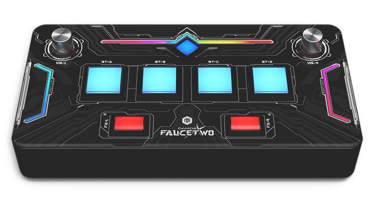    | [Gamo2 FAUCETWO+](https://www.gamo2.com/en/index.php?dispatch=products.view&product_id=394)  | $169.00 - $466.20 + $114 shipping   |                     |
| 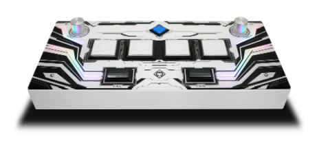          | [YUANCON SDVX 12](https://yuancon.store/controller/controller)                               | $188.00 - $333.00 + $79 shipping    |                     |
| 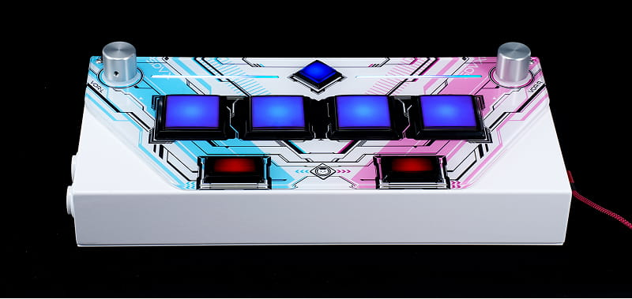        | [YUANCON SDVX LITE 3](https://yuancon.store/controller/sdvxlite)                             | $143.00 - $290.00 + $69 shipping    |                     |
| 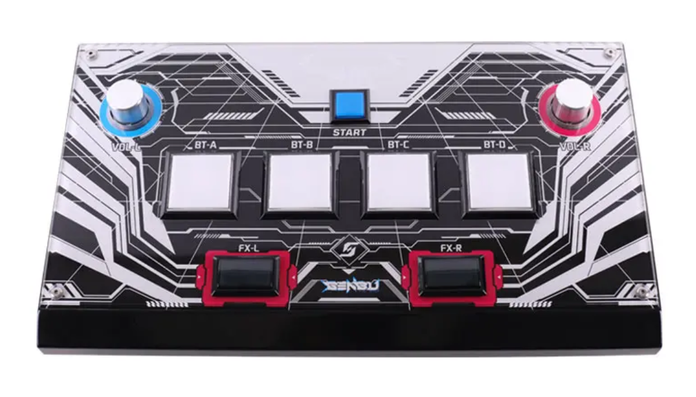       | [GENBU SDVX](https://genbu.store/products/genbu-sdvx-sound-voltex-pc-usb-controller)         | $251.00 + $79 shipping              |                     |
| 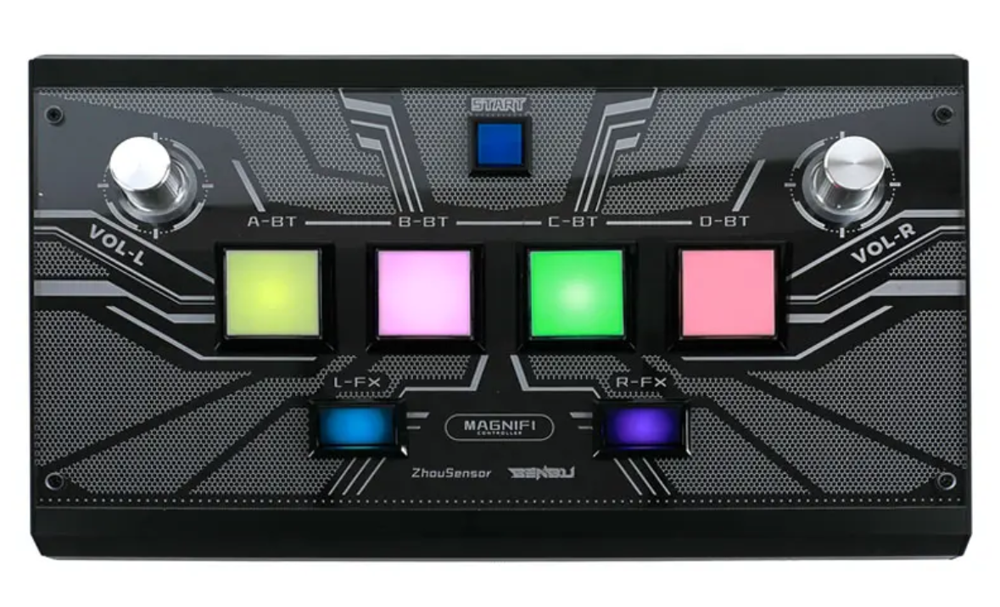    | [GENBU MAGNIFI](https://genbu.store/products/genbu-sdvx-controller)                          | $258.00 + $79 shipping              |                     |
| 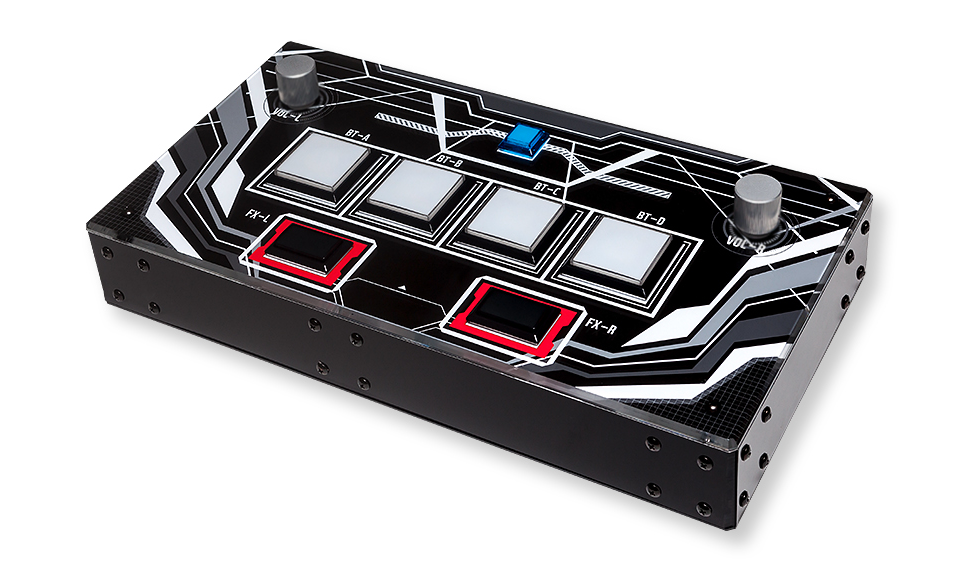     | [ISTMALL SDVX](https://www.us.istmall.co.kr/Product/Detail/view/pid/212/cid/113)             | $258.00 - $348.00 + shipping        |                     |
| 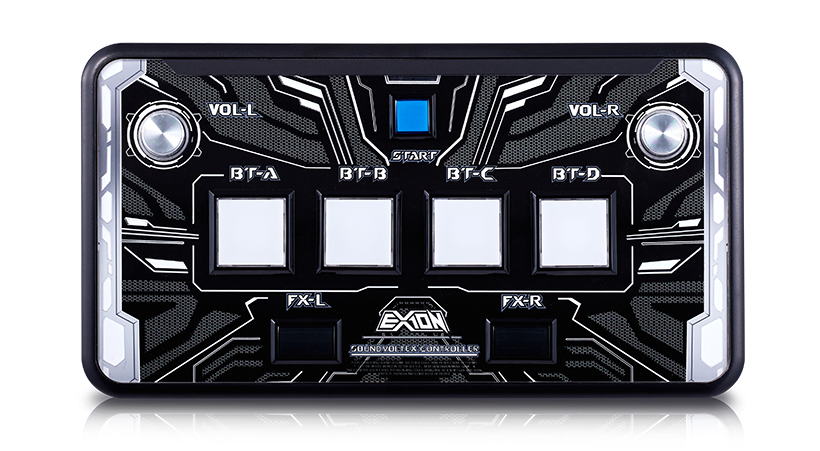    | [ISTMALL EXION](https://www.us.istmall.co.kr/Product/Detail/view/pid/788/cid/113)            | $248.00 - $493.00 + shipping        |                     |
| 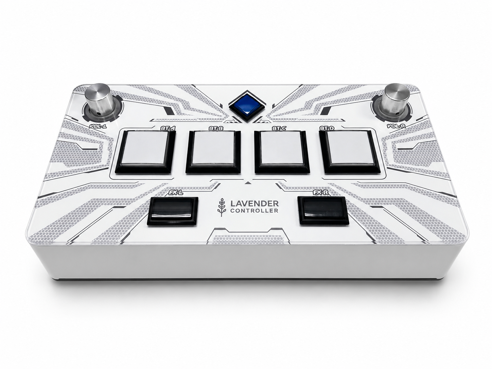         | [LAVENDER SDVX](https://lavender-labs.com/)                                                  | $229.00 + $130 shipping             |                     |

## Controlleurs officiels

| IMAGE                                                 | Modele                                                                                       | Prix                                | Commentaire/Retours |
| ----------------------------------------------------- | -------------------------------------------------------------------------------------------- | ----------------------------------- | ------------------- |
| 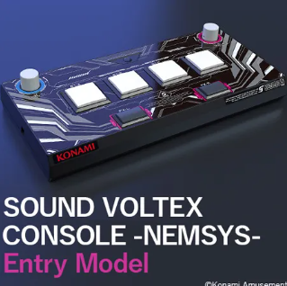     | KONAMI -Nemsys- Entry Model                                                                  | -                                   |                     |
| 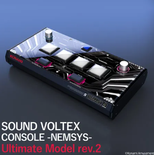  | KONAMI -Nemsys- Ultimate Model rev.2                                                         | -                                   |                     |

## Mini controlleur

| IMAGE                                                 | Modele                                                                                       | Prix                                | Commentaire/Retours |
| ----------------------------------------------------- | -------------------------------------------------------------------------------------------- | ----------------------------------- | ------------------- |
| 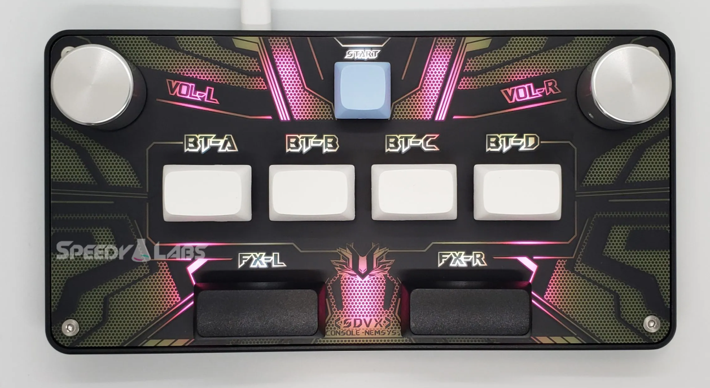        | [SpeedyLabs Pico v5](https://www.speedylabs.us/product/pocket-sdvx-pico-assembled/)          | $139.99 + $30.99 shipping           |                     |
| 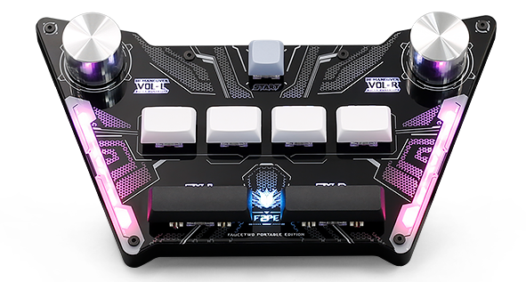    | [Gamo2 FAUCETWO PE](https://www.gamo2.com/en/index.php?dispatch=products.view&product_id=396)| $99.00 + $36.10 shipping            |                     |

## DIY

